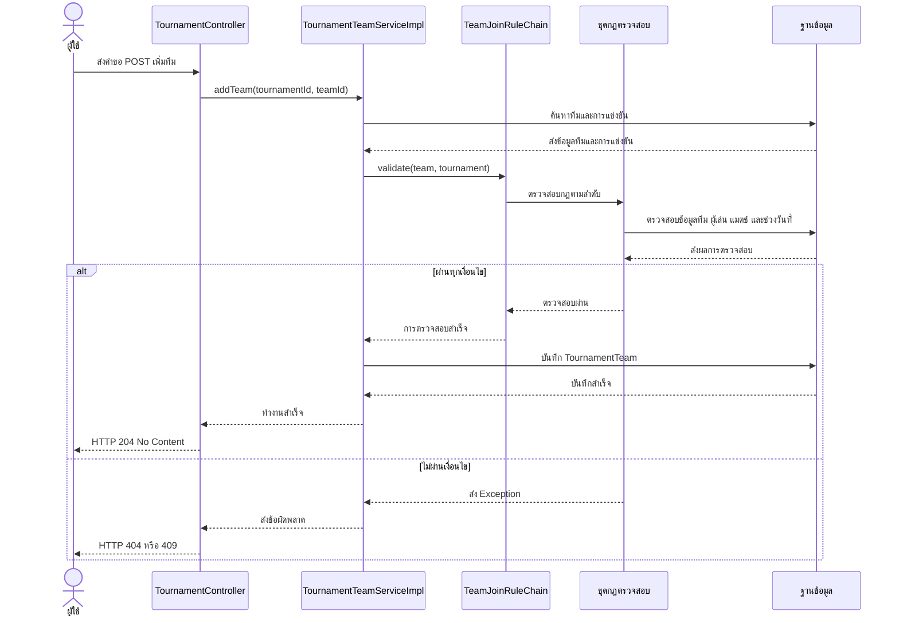

# รูปแบบการออกแบบระบบ (Design Patterns)

## 1. Chain of Responsibility — รูปแบบสายโซ่ความรับผิดชอบ

### 1.1 แนวคิด

Chain of Responsibility เป็นรูปแบบการออกแบบที่ส่งคำขอผ่านชุดของกฎตรวจสอบตามลำดับ โดยแต่ละกฎมีหน้าที่ตรวจสอบเงื่อนไขของตัวเอง หากตรวจสอบไม่ผ่าน ระบบจะหยุดการทำงานและส่งข้อผิดพลาดกลับไป แต่หากผ่าน ระบบจะส่งคำขอไปยังกฎถัดไป

### 1.2 การนำมาใช้ในระบบ

รูปแบบนี้ใช้ตรวจสอบความถูกต้องก่อนเพิ่มทีมเข้าร่วมการแข่งขัน โดยแบ่งหน้าที่ออกเป็นส่วนต่าง ๆ ดังนี้

* `TeamJoinRule` เป็น Interface ที่กำหนดเมธอดสำหรับตรวจสอบเงื่อนไขและเชื่อมต่อกฎถัดไป
* `TeamJoinRuleChain` ทำหน้าที่เชื่อมต่อกฎตรวจสอบทั้งหมดตามลำดับที่กำหนด
* คลาสกฎตรวจสอบแต่ละคลาสรับผิดชอบตรวจสอบเงื่อนไขเพียงอย่างเดียว
* `TournamentTeamServiceImpl` เรียกใช้ชุดกฎตรวจสอบก่อนบันทึกข้อมูลทีมเข้าร่วมการแข่งขัน

### 1.3 ลำดับการตรวจสอบ

1. `TeamExistsRule` ตรวจสอบว่ามีทีมอยู่ในระบบหรือไม่
2. `TournamentExistsRule` ตรวจสอบว่ามีการแข่งขันอยู่ในระบบหรือไม่
3. `TournamentStatusRule` ตรวจสอบว่าการแข่งขันมีสถานะ UPCOMING และยังไม่มีการสร้างแมตช์
4. `TeamNotAlreadyJoinedRule` ตรวจสอบว่าทีมยังไม่ได้สมัครการแข่งขันนี้
5. `TeamGameMatchRule` ตรวจสอบว่าเกมของทีมตรงกับเกมที่ใช้แข่งขัน
6. `TeamMinimumPlayersRule` ตรวจสอบว่าทีมมีจำนวนผู้เล่นไม่น้อยกว่าจำนวนขั้นต่ำที่เกมกำหนด
7. `TeamPointsLimitRule` ตรวจสอบว่าการแข่งขันรูปแบบ POINTS ยังมีจำนวนทีมไม่ถึง 12 ทีม
8. `TeamTournamentDateRule` ตรวจสอบว่าทีมไม่ได้เข้าร่วมการแข่งขันอื่นที่มีช่วงเวลาทับซ้อนกัน

หากกฎข้อใดไม่ผ่าน ระบบจะหยุดตรวจสอบทันทีและไม่บันทึกทีมเข้าร่วมการแข่งขัน

### 1.4 การจัดการข้อผิดพลาด

ระบบใช้ Exception เพื่อแจ้งผลการตรวจสอบให้ผู้เรียกทราบ ได้แก่

* `ResourceNotFoundException` ส่งสถานะ HTTP 404 เมื่อไม่พบทีม หรือไม่พบการแข่งขัน
* `ValidationException` ส่งสถานะ HTTP 400 เมื่อข้อมูลไม่ถูกต้องตามเงื่อนไขที่กำหนด
* `BusinessException` ส่งสถานะ HTTP 409 เมื่อไม่ผ่านเงื่อนไขทางธุรกิจ เช่น ทีมสมัครซ้ำ จำนวนทีมเต็ม หรือช่วงเวลาการแข่งขันทับซ้อน

### 1.5 ข้อดีของรูปแบบนี้

* แยกการตรวจสอบแต่ละเงื่อนไขออกจากกัน ทำให้โค้ดอ่านและดูแลรักษาง่าย
* สามารถทดสอบกฎแต่ละข้อแยกจากกันได้
* กำหนดลำดับการตรวจสอบได้อย่างชัดเจน
* สามารถเพิ่มกฎใหม่ได้โดยไม่ต้องรวมเงื่อนไขทั้งหมดไว้ใน Service คลาสเดียว

### 1.6 ขอบเขตการทำงาน

ส่วนนี้รับผิดชอบเฉพาะการตรวจสอบเงื่อนไขก่อนเพิ่มทีมเข้าร่วมการแข่งขันเท่านั้น การสร้างตารางแข่งขันและสายการแข่งขันเป็นหน้าที่ของส่วนอื่น ระบบจะตรวจสอบเพียงว่ามีการสร้างแมตช์แล้วหรือไม่ โดยไม่สร้างตารางแข่งขันเอง

---

## 2. Activity Diagram — แผนภาพกิจกรรมการเพิ่มทีมเข้าร่วมการแข่งขัน

แผนภาพนี้แสดงขั้นตอนการทำงานตั้งแต่รับคำขอเพิ่มทีม ตรวจสอบเงื่อนไขทั้ง 8 ข้อ ไปจนถึงการบันทึกข้อมูล หรือส่งข้อผิดพลาดกลับไปยังผู้ใช้

---

## 3. Sequence Diagram — แผนภาพลำดับการเพิ่มทีมเข้าร่วมการแข่งขัน

แผนภาพนี้แสดงการสื่อสารระหว่างผู้ใช้ Controller, Service, ชุดกฎตรวจสอบ และฐานข้อมูล ตั้งแต่ส่งคำขอจนถึงการบันทึกข้อมูลสำเร็จ

