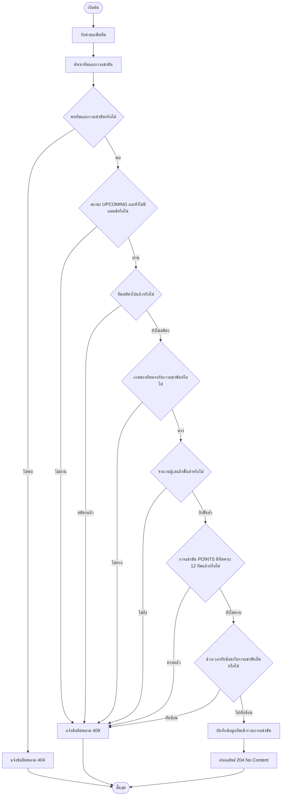
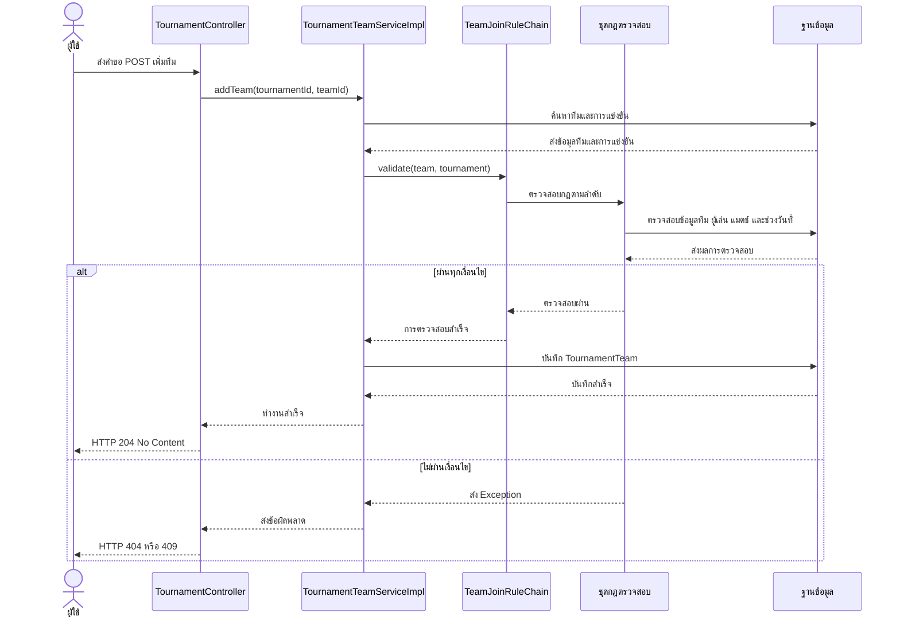
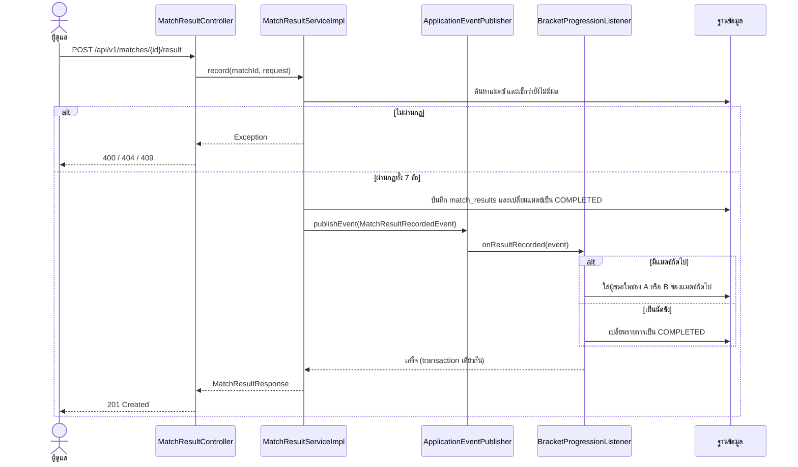

# รูปแบบการออกแบบระบบ (Design Patterns)

## 1. Chain of Responsibility — รูปแบบสายโซ่ความรับผิดชอบ

### 1.1 แนวคิด

Chain of Responsibility เป็นรูปแบบการออกแบบที่ส่งคำขอผ่านชุดของกฎตรวจสอบตามลำดับ โดยแต่ละกฎมีหน้าที่ตรวจสอบเงื่อนไขของตัวเอง หากตรวจสอบไม่ผ่าน ระบบจะหยุดการทำงานและส่งข้อผิดพลาดกลับไป แต่หากผ่าน ระบบจะส่งคำขอไปยังกฎถัดไป

### 1.2 การนำมาใช้ในระบบ

รูปแบบนี้ใช้ตรวจสอบความถูกต้องก่อนเพิ่มทีมเข้าร่วมการแข่งขัน โดยแบ่งหน้าที่ออกเป็นส่วนต่าง ๆ ดังนี้

* `TeamJoinRule` เป็น Interface ที่กำหนดเมธอดสำหรับตรวจสอบเงื่อนไขและเชื่อมต่อกฎถัดไป
* `TeamJoinRuleChain` ทำหน้าที่เชื่อมต่อกฎตรวจสอบทั้งหมดตามลำดับที่กำหนด
* คลาสกฎตรวจสอบแต่ละคลาสรับผิดชอบตรวจสอบเงื่อนไขเพียงอย่างเดียว
* `TournamentTeamServiceImpl` เรียกใช้ชุดกฎตรวจสอบก่อนบันทึกข้อมูลทีมเข้าร่วมการแข่งขัน

### 1.3 ลำดับการตรวจสอบ

1. `TeamExistsRule` ตรวจสอบว่ามีทีมอยู่ในระบบหรือไม่
2. `TournamentExistsRule` ตรวจสอบว่ามีการแข่งขันอยู่ในระบบหรือไม่
3. `TournamentStatusRule` ตรวจสอบว่าการแข่งขันมีสถานะ UPCOMING และยังไม่มีการสร้างแมตช์
4. `TeamNotAlreadyJoinedRule` ตรวจสอบว่าทีมยังไม่ได้สมัครการแข่งขันนี้
5. `TeamGameMatchRule` ตรวจสอบว่าเกมของทีมตรงกับเกมที่ใช้แข่งขัน
6. `TeamMinimumPlayersRule` ตรวจสอบว่าทีมมีจำนวนผู้เล่นไม่น้อยกว่าจำนวนขั้นต่ำที่เกมกำหนด
7. `TeamPointsLimitRule` ตรวจสอบว่าการแข่งขันรูปแบบ POINTS ยังมีจำนวนทีมไม่ถึง 12 ทีม
8. `TeamTournamentDateRule` ตรวจสอบว่าทีมไม่ได้เข้าร่วมการแข่งขันอื่นที่มีช่วงเวลาทับซ้อนกัน

หากกฎข้อใดไม่ผ่าน ระบบจะหยุดตรวจสอบทันทีและไม่บันทึกทีมเข้าร่วมการแข่งขัน

### 1.4 การจัดการข้อผิดพลาด

ระบบใช้ Exception เพื่อแจ้งผลการตรวจสอบให้ผู้เรียกทราบ ได้แก่

* `ResourceNotFoundException` ส่งสถานะ HTTP 404 เมื่อไม่พบทีม หรือไม่พบการแข่งขัน
* `ValidationException` ส่งสถานะ HTTP 400 เมื่อข้อมูลไม่ถูกต้องตามเงื่อนไขที่กำหนด
* `BusinessException` ส่งสถานะ HTTP 409 เมื่อไม่ผ่านเงื่อนไขทางธุรกิจ เช่น ทีมสมัครซ้ำ จำนวนทีมเต็ม หรือช่วงเวลาการแข่งขันทับซ้อน

### 1.5 ข้อดีของรูปแบบนี้

* แยกการตรวจสอบแต่ละเงื่อนไขออกจากกัน ทำให้โค้ดอ่านและดูแลรักษาง่าย
* สามารถทดสอบกฎแต่ละข้อแยกจากกันได้
* กำหนดลำดับการตรวจสอบได้อย่างชัดเจน
* สามารถเพิ่มกฎใหม่ได้โดยไม่ต้องรวมเงื่อนไขทั้งหมดไว้ใน Service คลาสเดียว

### 1.6 ขอบเขตการทำงาน

ส่วนนี้รับผิดชอบเฉพาะการตรวจสอบเงื่อนไขก่อนเพิ่มทีมเข้าร่วมการแข่งขันเท่านั้น การสร้างตารางแข่งขันและสายการแข่งขันเป็นหน้าที่ของส่วนอื่น ระบบจะตรวจสอบเพียงว่ามีการสร้างแมตช์แล้วหรือไม่ โดยไม่สร้างตารางแข่งขันเอง

---

## 2. Activity Diagram — แผนภาพกิจกรรมการเพิ่มทีมเข้าร่วมการแข่งขัน

แผนภาพนี้แสดงขั้นตอนการทำงานตั้งแต่รับคำขอเพิ่มทีม ตรวจสอบเงื่อนไขทั้ง 8 ข้อ ไปจนถึงการบันทึกข้อมูล หรือส่งข้อผิดพลาดกลับไปยังผู้ใช้

---

## 3. Sequence Diagram — แผนภาพลำดับการเพิ่มทีมเข้าร่วมการแข่งขัน

แผนภาพนี้แสดงการสื่อสารระหว่างผู้ใช้ Controller, Service, ชุดกฎตรวจสอบ และฐานข้อมูล ตั้งแต่ส่งคำขอจนถึงการบันทึกข้อมูลสำเร็จ

## คนที่ 4: โมดูลรูปแบบการแข่ง

### Strategy Pattern (Pattern หลักของโมดูลนี้)

| หัวข้อ | รายละเอียด |
| --- | --- |
| **ปัญหาที่แก้** | รายการแข่งมี 2 รูปแบบที่สร้างตารางต่างกันโดยสิ้นเชิง แพ้คัดออกต้องสร้างสายแมตช์พร้อม `next_match_id` และจัดบาย ส่วนเก็บคะแนน (Free Fire) ต้องสร้างเกมย่อย 1..`totalGames` ถ้าเขียนรวมไว้ใน Service เดียวจะเป็น `if (format == ...)` ยาวขึ้นทุกครั้งที่มีรูปแบบใหม่ และแก้รูปแบบหนึ่งอาจกระทบอีกรูปแบบ |
| **วิธีแก้** | แยกอัลกอริทึมแต่ละแบบเป็นคลาสของตัวเองที่ implement interface เดียวกัน แล้วให้ Service เลือกใช้ตัวที่ตรงกับ `tournament.format` ตอนทำงาน |
| **Class Diagram** | [doc/diagrams/class-diagram-bracket.md](diagrams/class-diagram-bracket.md) |
| **Sequence Diagram** | [doc/diagrams/sequence-diagram-schedule.md](diagrams/sequence-diagram-schedule.md) |

บทบาทของแต่ละคลาส

| บทบาท | คลาส | ไฟล์ |
| --- | --- | --- |
| Strategy (interface) | `FormatStrategy` | `service/format/FormatStrategy.java` |
| Concrete Strategy | `SingleEliminationStrategy` | `service/format/SingleEliminationStrategy.java` |
| Concrete Strategy | `PointsStrategy` | `service/format/PointsStrategy.java` |
| Context | `ScheduleServiceImpl` | `service/impl/ScheduleServiceImpl.java` |

**การเลือก Strategy:** `ScheduleServiceImpl` รับ `List<FormatStrategy>` ทาง constructor (Spring ส่ง `@Component` ทุกตัวให้) แล้วเก็บเป็น `Map<TournamentFormat, FormatStrategy>` โดยใช้ `format()` ของแต่ละตัวเป็น key จากนั้นดึงตัวที่ตรงกับ `tournament.getFormat()` มาเรียก `createSchedule`

**เพิ่มรูปแบบใหม่ในอนาคต** เช่น Round Robin: สร้างคลาสใหม่ที่ implement `FormatStrategy` ใส่ `@Component` และเพิ่มค่าใน `TournamentFormat` โดยไม่ต้องแก้ `ScheduleServiceImpl` (ดู [solid-analysis.md](solid-analysis.md) หลัก Open/Closed) หลักฐานในโปรเจคจริง: `PointsStrategy` ถูกเพิ่มทีหลัง `SingleEliminationStrategy` และ `ScheduleServiceImpl` ไม่ถูกแก้เลย

**การทดสอบ:** `ScheduleServiceImplTest` ส่ง `FormatStrategy` ที่เป็น mock เข้าไปแทนของจริง เพื่อพิสูจน์ว่า Service พึ่งพาแค่ interface

### Enterprise Patterns ที่ใช้ในโมดูลนี้

| Pattern | ปัญหาที่แก้ | ไฟล์/คลาส |
| --- | --- | --- |
| Service Layer | แยกกฎทางธุรกิจ (ตรวจสถานะ, ตรวจจำนวนทีม, เลือก Strategy) ออกจาก Controller | `ScheduleService`, `ScheduleServiceImpl`, `MatchService`, `MatchServiceImpl` |
| Repository | แยกการเข้าถึงฐานข้อมูลออกจากกฎทางธุรกิจ | `MatchRepository`, `TournamentRepository`, `FreeFireGameRepository` |
| DTO | ไม่ส่ง Entity (ที่มี lazy relation) ออกไปให้ client | `MatchResponse`, `ScheduleResponse` |
| Data Mapper | แปลง Entity เป็น DTO ในที่เดียว | `MatchMapper` |
| Dependency Injection | ให้ Spring ประกอบคลาสให้ ไม่สร้างกันเอง ทำให้สลับเป็น mock ตอนทดสอบได้ | constructor ของ `ScheduleServiceImpl`, `ScheduleController` และ `MatchController` |

## คนที่ 5: โมดูลผลการแข่ง

### Observer Pattern (Pattern หลักของโมดูลนี้)

| หัวข้อ | รายละเอียด |
| --- | --- |
| **ปัญหาที่แก้** | พอบันทึกผลแล้ว ระบบยังมีงานต่ออีก: แบบแพ้คัดออกต้องส่งผู้ชนะไปช่องของแมตช์ถัดไป และถ้าเป็นนัดชิงต้องเปลี่ยนรายการเป็น COMPLETED ส่วนแบบเก็บคะแนนต้องเช็กว่าแข่งครบทุกเกมแล้วหรือยัง ถ้าเขียนงานพวกนี้ไว้ใน Service บันทึกผลทั้งหมด Service จะทำหลายหน้าที่เกินไป และทุกครั้งที่มีงานใหม่ต้องเกิดขึ้นหลังบันทึกผล (เช่น แจ้งเตือน) ก็ต้องกลับมาแก้ Service ตัวเดิม |
| **วิธีแก้** | Service บันทึกผลแล้ว **ประกาศเหตุการณ์ (event)** ออกไปเท่านั้น โดยไม่รู้ว่าใครรอฟังอยู่ งานต่อเนื่องแต่ละอย่างแยกเป็น **Listener** ของตัวเองที่รอรับ event นั้น ทำได้ผ่านกลไก `ApplicationEventPublisher` และ `@EventListener` ของ Spring |
| **Sequence Diagram** | [doc/diagrams/sequence-diagram-result.md](diagrams/sequence-diagram-result.md) (ฉบับเต็มทั้งสองรูปแบบ) |

บทบาทของแต่ละคลาส

| บทบาท | คลาส | ไฟล์ |
| --- | --- | --- |
| Subject (ผู้ประกาศ) | `MatchResultServiceImpl` | `service/impl/MatchResultServiceImpl.java` |
| Subject (ผู้ประกาศ) | `FreeFireResultServiceImpl` | `service/impl/FreeFireResultServiceImpl.java` |
| Event | `MatchResultRecordedEvent(matchId, winnerTeamId)` | `event/MatchResultRecordedEvent.java` |
| Event | `FreeFireGameRecordedEvent(gameId, tournamentId)` | `event/FreeFireGameRecordedEvent.java` |
| Observer (ผู้รับ) | `BracketProgressionListener` | `event/BracketProgressionListener.java` |
| Observer (ผู้รับ) | `FreeFireCompletionListener` | `event/FreeFireCompletionListener.java` |
| ตัวกลางส่ง event | `ApplicationEventPublisher` (ของ Spring) | ส่งเข้ามาทาง constructor ของ Service |

**หน้าที่ของ Observer แต่ละตัว**

* `BracketProgressionListener` รับ `MatchResultRecordedEvent` แล้วส่งผู้ชนะไปแมตช์ถัดไป (`next_match_id`) โดยแมตช์เลขคี่ไปช่อง A และเลขคู่ไปช่อง B ถ้ารู้ทีมครบทั้งสองฝั่งแล้วจะเปลี่ยนแมตช์นั้นเป็น SCHEDULED แต่ถ้าไม่มีแมตช์ถัดไป แปลว่าเป็นนัดชิง จึงเปลี่ยนรายการเป็น `TournamentStatus.COMPLETED`
* `FreeFireCompletionListener` รับ `FreeFireGameRecordedEvent` แล้วนับเกมที่ COMPLETED ถ้าครบ `total_games` จะเปลี่ยนรายการเป็น `TournamentStatus.COMPLETED`

**ทำงานใน Transaction เดียวกัน:** `@EventListener` ของ Spring เรียก Listener ทันทีใน thread และ transaction เดียวกับ Service ถ้า Listener โยน Exception (เช่น ช่องของแมตช์ถัดไปมีทีมอื่นอยู่แล้ว) ผลที่เพิ่งบันทึกจะถูก rollback ไปด้วย ข้อมูลผลกับสายการแข่งจึงไม่มีทางขัดกัน ที่เลือกแบบนี้แทน `@TransactionalEventListener` เพราะต้องการให้ทั้งสองอย่างสำเร็จหรือล้มเหลวไปพร้อมกัน

### ลำดับการทำงาน (บันทึกผลแบบแพ้คัดออก)

แบบเก็บคะแนนทำงานแบบเดียวกัน ต่างกันที่ `FreeFireResultServiceImpl` ประกาศ `FreeFireGameRecordedEvent` และ `FreeFireCompletionListener` เป็นตัวรับ

### ข้อดีที่ได้ในโปรเจคนี้

* **Service ทำหน้าที่เดียว:** Service แค่ตรวจกฎและบันทึกผล ไม่ต้องรู้เรื่องสายการแข่งหรือการจบรายการ (ดู [solid-analysis.md](solid-analysis.md))
* **เพิ่มงานใหม่ได้โดยไม่แก้ของเดิม:** ถ้าอยากแจ้งเตือนเมื่อมีผลใหม่ ก็สร้าง Listener ตัวใหม่ที่รับ `MatchResultRecordedEvent` ได้เลย ไม่ต้องแตะ `MatchResultServiceImpl`
* **ทดสอบแยกกันได้:** `MatchResultServiceImplTest` ใช้ `ApplicationEventPublisher` ที่เป็น mock แล้ว `verify` ว่ามีการประกาศ event ส่วน `BracketProgressionListenerTest` กับ `FreeFireCompletionListenerTest` ทดสอบ Listener ตรงๆ โดยไม่ต้องผ่าน Service

### Enterprise Patterns ที่ใช้ในโมดูลนี้

| Pattern | ปัญหาที่แก้ | ไฟล์/คลาส |
| --- | --- | --- |
| Service Layer | แยกกฎการบันทึกผลออกจาก Controller | `MatchResultService`, `MatchResultServiceImpl`, `FreeFireResultService`, `FreeFireResultServiceImpl` |
| Repository | แยกการเข้าถึงฐานข้อมูลออกจากกฎทางธุรกิจ | `MatchResultRepository`, `FreeFireGameRepository`, `FreeFireGameResultRepository`, `TournamentPlacementPointRepository` |
| DTO | ไม่ส่ง Entity ออกไปให้ client และตรวจข้อมูลขาเข้าด้วย Bean Validation | `CreateMatchResultRequest`, `RecordFreeFireResultsRequest`, `MatchResultResponse`, `FreeFireStandingsResponse` |
| Data Mapper | แปลง Entity เป็น DTO ในที่เดียว | `MatchResultMapper` |
| Domain Service | แยกการคำนวณคะแนนและการตัดสินอันดับ (Booyah → Kills → อันดับเกมล่าสุด) ออกเป็นคลาสที่ไม่ยุ่งกับฐานข้อมูล | `PointsCalculator` |
| Dependency Injection | ให้ Spring ประกอบคลาสให้ ทำให้สลับเป็น mock ตอนทดสอบได้ | constructor ของ Service, Listener และ Controller ทั้งหมด |

