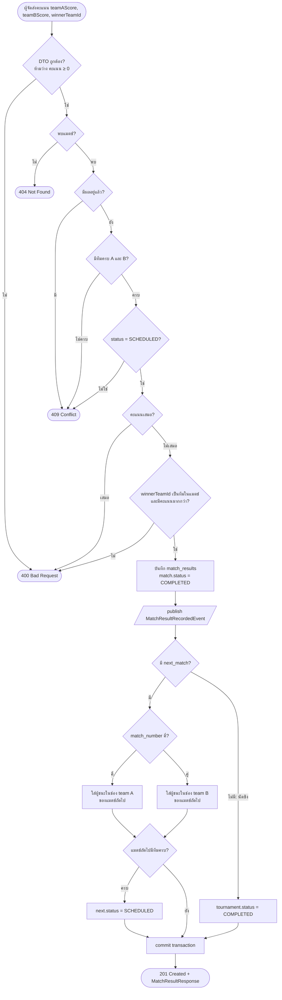
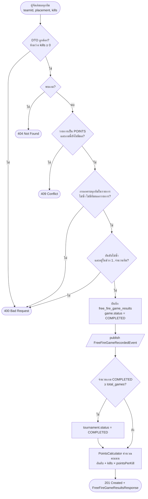

# Activity Diagram: การบันทึกผลการแข่ง

แสดงการตัดสินใจทุกขั้นของการบันทึกผลทั้งสองรูปแบบ ลำดับการเรียกระหว่างคลาสดูได้ที่ [sequence-diagram-result.md](sequence-diagram-result.md)

## 1. แบบแพ้คัดออก: `POST /api/v1/matches/{matchId}/result`

ตาม `MatchResultServiceImpl.record` และ `BracketProgressionListener`

## 2. แบบเก็บคะแนน Free Fire: `POST /api/v1/free-fire-games/{gameId}/results`

ตาม `FreeFireResultServiceImpl.record` และ `FreeFireCompletionListener`

## หมายเหตุ

- ทุกขั้นอยู่ใน transaction เดียว ถ้า Listener ล้มเหลว ผลที่บันทึกจะถูก rollback ด้วย
- ผลที่บันทึกแล้วแก้ไม่ได้ในตอนนี้ (บันทึกซ้ำตอบ 409)
- คะแนน Free Fire ไม่ได้เก็บลงฐานข้อมูล ตารางคะแนนรวมคำนวณใหม่ทุกครั้งที่เรียก `GET /tournaments/{id}/standings`
