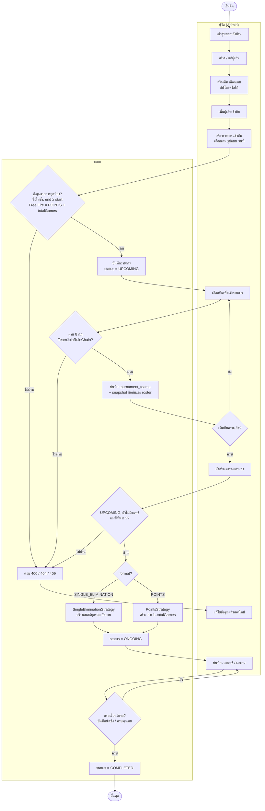

# Activity Diagram: วงจรการจัดรายการแข่งขัน

ขั้นตอนตั้งแต่ผู้จัดเตรียมข้อมูล สร้างรายการ ไปจนจบการแข่งขัน แบ่ง swimlane เป็น **ผู้จัด** และ **ระบบ** ส่วนผู้ชมดูข้อมูลได้ทุกช่วงโดยไม่กระทบขั้นตอนนี้

## หมายเหตุ

- ผู้จัดแก้ / ลบรายการได้ระหว่าง `UPCOMING` เท่านั้น เมื่อเป็น `ONGOING` แล้วลบรายการ (409), เพิ่มหรือถอนทีม และสร้างตารางซ้ำไม่ได้
- ทีมที่เข้ารายการแล้วลบไม่ได้ (`Team has tournament history`) และเปลี่ยนเกมของทีมไม่ได้
- ขั้นบันทึกผลแยกละเอียดไว้ใน [activity-record-result.md](activity-record-result.md)
- เงื่อนไข 8 ข้อของการเพิ่มทีมเข้ารายการอยู่ใน Activity Diagram ของ [../design-patterns.md](../design-patterns.md) หัวข้อ 2
- สถานะ `UPCOMING → ONGOING → COMPLETED` ดูแบบ State Diagram ได้ที่ [state-diagram-match-tournament.md](state-diagram-match-tournament.md)
