# Class Diagram: โมดูลรูปแบบการแข่ง (คนที่ 4)

แสดงโครงสร้างคลาสของโมดูลสร้างตารางการแข่ง และตำแหน่งของ **Strategy Pattern**

```mermaid
classDiagram
    direction LR

    class ScheduleController {
        +create(tournamentId) ScheduleResponse
        +matches(tournamentId) List~MatchResponse~
    }
    class MatchController {
        +list(pageable) PageResponse~MatchResponse~
        +get(id) MatchResponse
    }

    class ScheduleService {
        <<interface>>
        +createSchedule(tournamentId) ScheduleResponse
        +listMatches(tournamentId) List~MatchResponse~
    }
    class MatchService {
        <<interface>>
        +list(pageable) Page~MatchResponse~
        +get(id) MatchResponse
    }

    class ScheduleServiceImpl {
        -strategies : Map~TournamentFormat, FormatStrategy~
        +createSchedule(tournamentId) ScheduleResponse
        +listMatches(tournamentId) List~MatchResponse~
    }
    class MatchServiceImpl {
        +list(pageable) Page~MatchResponse~
        +get(id) MatchResponse
    }

    class FormatStrategy {
        <<interface>>
        +format() TournamentFormat
        +createSchedule(tournament, teamsInSeedOrder) int
    }
    class SingleEliminationStrategy {
        +format() TournamentFormat
        +createSchedule(tournament, teamsInSeedOrder) int
        +buildBracket(tournament, teams) List~Match~
        ~seedOrder(size) int[]
    }
    class PointsStrategy {
        +format() TournamentFormat
        +createSchedule(tournament, teamsInSeedOrder) int
    }

    class MatchMapper {
        +toResponse(match) MatchResponse
    }
    class MatchRepository {
        <<interface>>
        +existsByTournamentId(id) boolean
        +findByTournamentIdOrderByRoundNumberAscMatchNumberAsc(id) List~Match~
    }
    class FreeFireGameRepository {
        <<interface>>
    }
    class TournamentRepository {
        <<interface>>
    }
    class TournamentTeamRepository {
        <<interface>>
        +findByTournamentIdOrderByJoinedAtAsc(id) List~TournamentTeam~
    }

    class TournamentFormat {
        <<enumeration>>
        SINGLE_ELIMINATION
        POINTS
    }

    ScheduleController --> ScheduleService
    MatchController --> MatchService
    ScheduleService <|.. ScheduleServiceImpl
    MatchService <|.. MatchServiceImpl

    ScheduleServiceImpl o-- FormatStrategy : เลือกตาม tournament.format
    FormatStrategy <|.. SingleEliminationStrategy
    FormatStrategy <|.. PointsStrategy
    FormatStrategy ..> TournamentFormat

    ScheduleServiceImpl --> TournamentRepository
    ScheduleServiceImpl --> TournamentTeamRepository
    ScheduleServiceImpl --> MatchRepository
    ScheduleServiceImpl --> MatchMapper
    MatchServiceImpl --> MatchRepository
    MatchServiceImpl --> MatchMapper
    SingleEliminationStrategy --> MatchRepository
    PointsStrategy --> FreeFireGameRepository

    note for FormatStrategy "Strategy Pattern\nFormatStrategy คือ Strategy\nSingleEliminationStrategy และ PointsStrategy คือ Concrete Strategy\nScheduleServiceImpl คือ Context"
```

## ตำแหน่งของ Pattern

| บทบาท | คลาส | ไฟล์ |
| --- | --- | --- |
| Strategy (interface) | `FormatStrategy` | `service/format/FormatStrategy.java` |
| Concrete Strategy | `SingleEliminationStrategy` | `service/format/SingleEliminationStrategy.java` |
| Concrete Strategy | `PointsStrategy` | `service/format/PointsStrategy.java` |
| Context | `ScheduleServiceImpl` | `service/impl/ScheduleServiceImpl.java` |

## หมายเหตุ

- `ScheduleServiceImpl` รับ `List<FormatStrategy>` ผ่าน constructor แล้วเก็บเป็น `Map` โดยใช้ `format()` เป็น key จึงรู้จักแค่ interface (Dependency Inversion)
- เพิ่มรูปแบบการแข่งใหม่ = เพิ่มคลาสใหม่ที่ implement `FormatStrategy` และใส่ `@Component` โดยไม่ต้องแก้ `ScheduleServiceImpl` (Open/Closed)
- Controller ทั้งสองเรียกผ่าน Service เท่านั้น ไม่เรียก Repository ตรง
