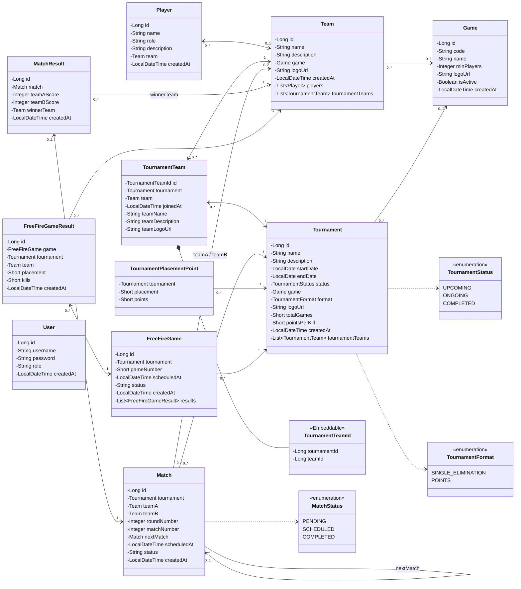
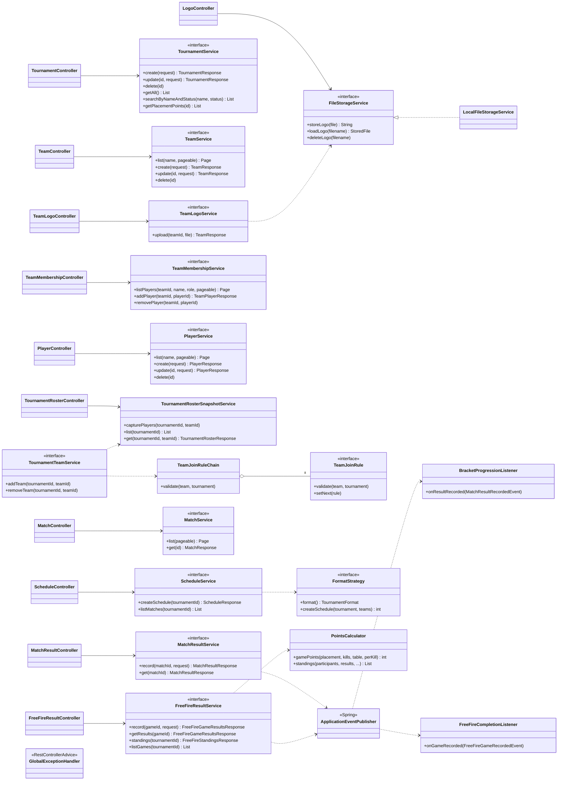

# Class Diagram: ภาพรวมระบบ

แบ่งเป็น 2 ส่วน ส่วนแรกคือ Entity (`domain/entity`) ส่วนที่สองคือชั้น Controller → Service → Repository ของทุกโมดูล รายละเอียดโมดูลสร้างตารางการแข่ง (Strategy Pattern) อยู่ใน [class-diagram-bracket.md](class-diagram-bracket.md)

## 1. Entity

`Match.status` และ `FreeFireGame.status` ยังเก็บเป็น `String` (ค่าจาก `MatchStatus.X.name()`) ส่วน `Tournament` ใช้ Enum ด้วย `@Enumerated(EnumType.STRING)` แล้ว

## 2. ชั้น Controller → Service → Repository

แสดงเฉพาะ interface ของ Service และ dependency หลัก คลาส `*ServiceImpl` ทุกตัว implement interface ชื่อเดียวกัน (ยกเว้น `TournamentRosterSnapshotService` ที่เป็นคลาสเลย)

## Design Pattern ที่อยู่ในแผนภาพ

| Pattern | คลาสที่เกี่ยวข้อง | รายละเอียด |
| --- | --- | --- |
| Strategy | `FormatStrategy`, `SingleEliminationStrategy`, `PointsStrategy` | [class-diagram-bracket.md](class-diagram-bracket.md) |
| Chain of Responsibility | `TeamJoinRule` + 8 กฎ, `TeamJoinRuleChain` | [../design-patterns.md](../design-patterns.md) |
| Observer | `MatchResultRecordedEvent` → `BracketProgressionListener`, `FreeFireGameRecordedEvent` → `FreeFireCompletionListener` | [sequence-diagram-result.md](sequence-diagram-result.md) |
| Repository / DTO + Mapper | `*Repository` (Spring Data JPA), `dto/*`, `mapper/*` | |
