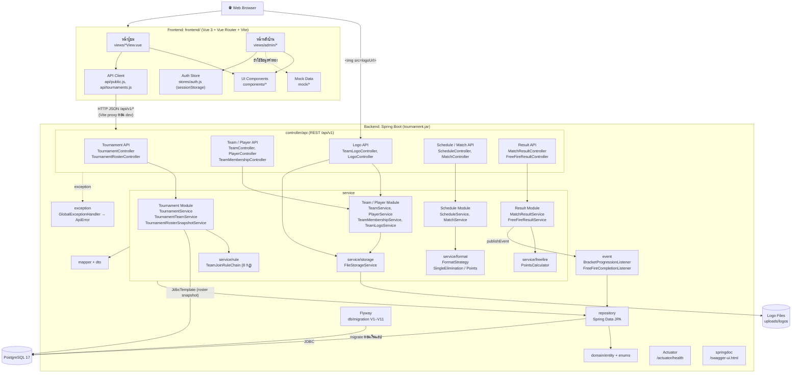

# Component Diagram: ส่วนประกอบของระบบ

ระบบแบ่งเป็น 3 ส่วนใหญ่: Frontend (Vue 3 + Vite), Backend (Spring Boot 4, Java 21) และ PostgreSQL ภายใน Backend แบ่งชั้นเป็น Controller → Service → Repository ตามแพ็กเกจใน `code/backend/src/main/java/com/example/tournament/`

## หน้าที่ของแต่ละ Component

| Component | หน้าที่ | ตำแหน่ง |
| --- | --- | --- |
| หน้าผู้ชม | หน้าแรก, รายการแข่ง, รายละเอียดรายการ (สาย / ตารางคะแนน), รายละเอียดแมตช์ | `code/frontend/src/views/` |
| หน้าหลังบ้าน | จัดการรายการ ทีม ผู้เล่น แมตช์ และผล Free Fire | `code/frontend/src/views/admin/` |
| API Client | เรียก `/api/v1/*` แล้วแปลงข้อมูลให้หน้าเว็บใช้ | `code/frontend/src/api/` |
| REST Controller | รับ HTTP request, ตรวจ DTO ด้วย `@Valid`, เรียก Service | `controller/api/` |
| Service | Business logic และ transaction | `service/`, `service/impl/` |
| Rule Chain | ตรวจ 8 เงื่อนไขก่อนเพิ่มทีมเข้ารายการ | `service/rule/` |
| Format Strategy | สร้างสายแพ้คัดออก หรือสร้างเกม Free Fire ตามรูปแบบรายการ | `service/format/` |
| Points Calculator | คำนวณคะแนนต่อเกมและตารางคะแนนรวม | `service/freefire/` |
| Event Listener | งานหลังบันทึกผล: ส่งผู้ชนะต่อ, ปิดรายการ | `event/` |
| File Storage | เก็บและอ่านไฟล์โลโก้ | `service/storage/` |
| Repository | เข้าถึงฐานข้อมูลผ่าน JPA | `repository/` |
| GlobalExceptionHandler | แปลง exception เป็น 400 / 404 / 409 รูปแบบ `ApiError` | `exception/` |
| Flyway | สร้างและอัปเดต schema ตอนแอปเริ่ม (`ddl-auto=validate`) | `code/backend/src/main/resources/db/migration/` |

## Interface ระหว่าง Component

| ผู้เรียก | ผู้ให้บริการ | Interface |
| --- | --- | --- |
| Frontend | Backend | REST JSON `/api/v1/*` (ดูทั้งหมดที่ `/swagger-ui.html`) |
| Browser | Backend | `GET /api/v1/logos/{filename}` สำหรับรูปโลโก้ |
| Service | Listener | Spring `ApplicationEventPublisher` (`MatchResultRecordedEvent`, `FreeFireGameRecordedEvent`) |
| Repository | PostgreSQL | JDBC (`spring.datasource.*` จาก Environment Variable) |
| TeamLogoService | ที่เก็บไฟล์ | `FileStorageService` (ตอนนี้มี `LocalFileStorageService` ตัวเดียว) |
