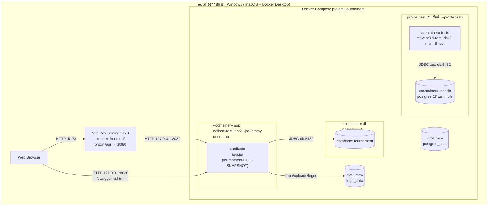
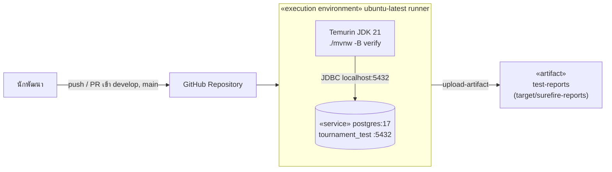
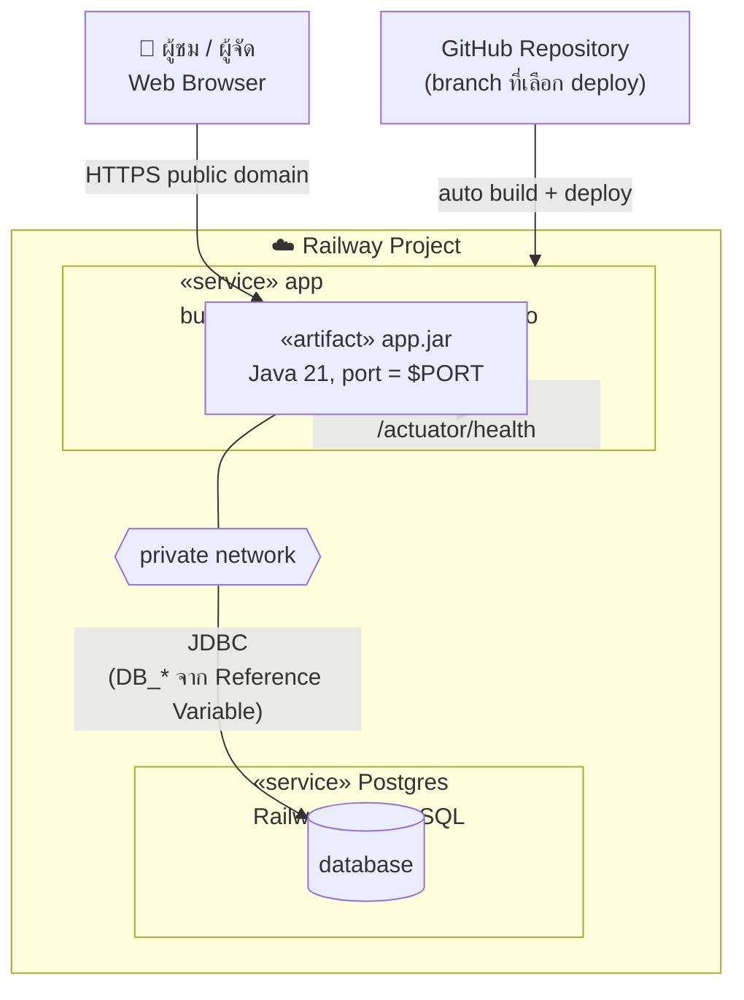

# Deployment Diagram

ระบบรันได้ 3 สภาพแวดล้อม: เครื่องนักพัฒนาด้วย Docker Compose, CI บน GitHub Actions และ Production บน Railway

## 1. เครื่องนักพัฒนา (Docker Compose)

ตาม `compose.yaml` และ `Dockerfile` พอร์ตทั้งหมด bind แค่ `127.0.0.1`

| Node | Image / Runtime | พอร์ต | ข้อมูลถาวร |
| --- | --- | --- | --- |
| `app` | build จาก `Dockerfile` target `runtime` (JRE 21) | `127.0.0.1:${APP_PORT:-8080}` | `logo_data` → `/app/uploads/logos` |
| `db` | `postgres:17` | `127.0.0.1:${DB_PORT:-5432}` | `postgres_data` |
| `tests` | `Dockerfile` target `development` (Maven + JDK 21) | – | – |
| `test-db` | `postgres:17` | – | `tmpfs` (หายเมื่อหยุด) |
| Vite | Node.js บนเครื่อง (`npm run dev`) | `5173` | – |

`app` รอจน `db` ผ่าน healthcheck (`pg_isready`) ก่อนเริ่ม และ healthcheck ของ `app` เรียก `/actuator/health`

## 2. CI (GitHub Actions)

## 3. Production (Railway)

ตาม `doc/deployment-prep.md` backend รุ่น V10 deploy และผ่าน health check แล้ว ส่วน V11 และ frontend ยังไม่ได้ deploy

| Environment Variable ของ `app` | ค่าบน Railway |
| --- | --- |
| `DB_HOST` | `${{Postgres.PGHOST}}` |
| `DB_PORT` | `${{Postgres.PGPORT}}` |
| `DB_NAME` | `${{Postgres.PGDATABASE}}` |
| `DB_USERNAME` | `${{Postgres.PGUSER}}` |
| `DB_PASSWORD` | `${{Postgres.PGPASSWORD}}` |
| `PORT` | Railway กำหนดให้เอง (อย่าตั้ง `APP_PORT` ทับ) |

## ข้อควรระวังก่อนเปิดใช้งานจริง

- **โลโก้บน Railway:** ตอนนี้เขียนไฟล์ลงดิสก์ของ container ไฟล์จะหายเมื่อ redeploy จนกว่าจะเลือก Railway Volume หรือ object storage
- **Auth:** API ที่เขียนข้อมูลยังไม่มีการป้องกัน ต้องทำ Spring Security ก่อนเผยแพร่ URL
- **Frontend:** ยังไม่มี node สำหรับ deploy frontend ต้องตัดสินใจว่าจะ build เป็นไฟล์ static แล้วให้ Spring Boot เสิร์ฟ หรือแยก service
