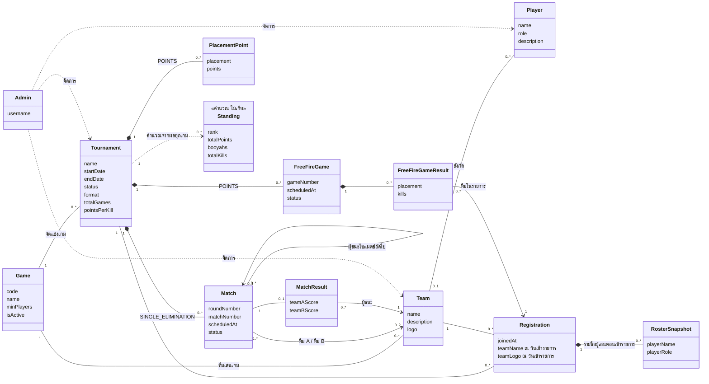

# Domain Model: ระบบจัดการสายแข่ง E-Sport

แสดงแนวคิดหลักของระบบและความสัมพันธ์ในมุมธุรกิจ ไม่ลงรายละเอียดคอลัมน์หรือคลาสในโค้ด (ดูรายละเอียดตารางได้ที่ [er-diagram.md](er-diagram.md))

## คำอธิบายแนวคิด

| แนวคิด | ความหมาย |
| --- | --- |
| **Game** | เกมที่เปิดให้จัดแข่ง (ROV, Free Fire, Valorant, Fighting Game) กำหนดจำนวนผู้เล่นขั้นต่ำต่อทีม |
| **Team** | ทีมผูกกับเกมเดียว เปลี่ยนเกมภายหลังไม่ได้ |
| **Player** | ผู้เล่นอยู่ได้ทีละไม่เกิน 1 ทีม หรือยังไม่มีทีมก็ได้ |
| **Tournament** | รายการแข่งของเกมหนึ่ง เลือกรูปแบบได้ 2 แบบ: `SINGLE_ELIMINATION` (สายแพ้คัดออก) หรือ `POINTS` (เก็บคะแนนหลายเกม ใช้กับ Free Fire) |
| **Registration** | ทีมที่ผู้จัดเพิ่มเข้ารายการ เก็บชื่อ คำอธิบาย และโลโก้ของทีม ณ ตอนเข้ารายการไว้ด้วย |
| **RosterSnapshot** | รายชื่อผู้เล่นของทีม ณ ตอนเข้ารายการ แก้ผู้เล่นภายหลังแล้วประวัติเดิมไม่เปลี่ยน |
| **Match / MatchResult** | แมตช์ในสายแพ้คัดออก ผู้ชนะถูกส่งต่อไป `nextMatch` แมตช์ที่ไม่มี `nextMatch` คือนัดชิง |
| **FreeFireGame / FreeFireGameResult** | เกมแต่ละรอบของรายการแบบเก็บคะแนน ผลเก็บอันดับและจำนวน kill ของทุกทีม |
| **PlacementPoint** | ตารางคะแนนตามอันดับของรายการ |
| **Standing** | ตารางคะแนนรวม คำนวณใหม่ทุกครั้ง (คะแนนอันดับ + kills × `pointsPerKill`) ไม่ได้บันทึกลงฐานข้อมูล |
| **Admin** | ผู้จัดเป็นผู้กรอกข้อมูลทั้งหมด ผู้ชมเข้าดูได้อย่างเดียว ระบบไม่เปิดให้ทีมสมัครเอง |
