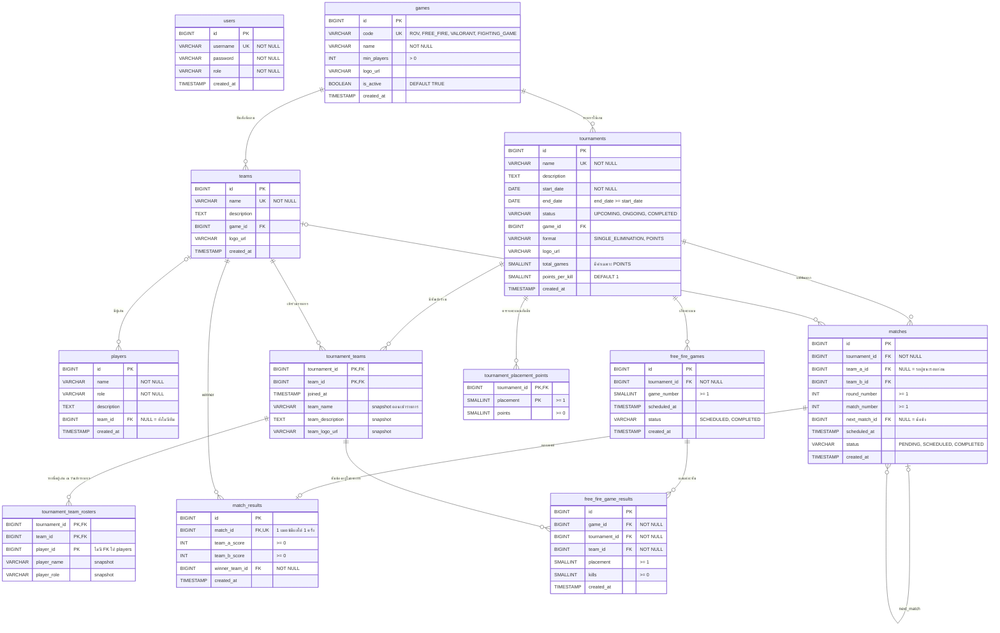

# ER Diagram: ฐานข้อมูลระบบจัดการสายแข่ง

โครงสร้างตารางหลังรัน Flyway migration `V1`–`V11` (PostgreSQL 17) ชื่อตารางและคอลัมน์ตรงกับไฟล์ใน `src/main/resources/db/migration/`

## กฎ ON DELETE ที่สำคัญ

| ความสัมพันธ์ | กฎ | ผล |
| --- | --- | --- |
| `players.team_id` → `teams` | `SET NULL` | ลบทีมแล้วผู้เล่นยังอยู่ แต่ไม่มีทีม |
| `tournament_teams.team_id` → `teams` | `RESTRICT` (V11) | ทีมที่มีประวัติแข่งลบไม่ได้ |
| `tournament_teams.tournament_id` → `tournaments` | `CASCADE` | ลบรายการแล้วลบทีมที่เข้าร่วมและ roster ตาม |
| `matches.tournament_id` → `tournaments` | `CASCADE` | ลบรายการแล้วลบแมตช์ตาม |
| `matches.team_a_id` / `team_b_id` → `teams` | `RESTRICT` | ทีมที่มีแมตช์ลบไม่ได้ |
| `matches.next_match_id` → `matches` | `SET NULL` | |
| `match_results.match_id` → `matches` | `CASCADE` | |
| `match_results.winner_team_id` → `teams` | `RESTRICT` | |
| `free_fire_game_results (game_id, tournament_id)` → `free_fire_games (id, tournament_id)` | `CASCADE` | FK แบบผสมบังคับว่าผลต้องเป็นของเกมในรายการเดียวกัน |
| `free_fire_game_results (tournament_id, team_id)` → `tournament_teams` | `RESTRICT` | บันทึกผลได้เฉพาะทีมที่อยู่ในรายการ |
| `teams.game_id`, `tournaments.game_id` → `games` | `RESTRICT` | เกมที่มีทีมหรือรายการใช้อยู่ลบไม่ได้ |

## Constraint อื่น ๆ

- `matches`: `UNIQUE (tournament_id, round_number, match_number)` และ `team_a_id <> team_b_id`
- `tournaments`: `CHECK ((format = 'POINTS') = (total_games IS NOT NULL))` แบบเก็บคะแนนต้องมี `total_games` ส่วนแบบแพ้คัดออกต้องไม่มี
- `free_fire_games`: `UNIQUE (tournament_id, game_number)`
- `free_fire_game_results`: `UNIQUE (game_id, team_id)` และ `UNIQUE (game_id, placement)` ทีมหนึ่งมีผลได้ครั้งเดียวต่อเกม และอันดับห้ามซ้ำ
- `tournament_team_rosters.player_id` ตั้งใจไม่ผูก FK ไป `players` เพื่อให้รายชื่อเดิมยังอยู่แม้ผู้เล่นถูกแก้ ย้ายทีม หรือถูกลบ

## หมายเหตุ

- ตาราง `users` มีใน schema แล้ว แต่ backend ยังไม่มีโค้ดที่ใช้ (งาน Auth ยังค้างใน `doc/REMAINING-WORK.md`)
- คะแนน Free Fire ไม่ได้เก็บเป็นคอลัมน์ `PointsCalculator` คำนวณจาก `placement`, `kills`, `tournament_placement_points` และ `points_per_kill` ทุกครั้งที่เรียก
