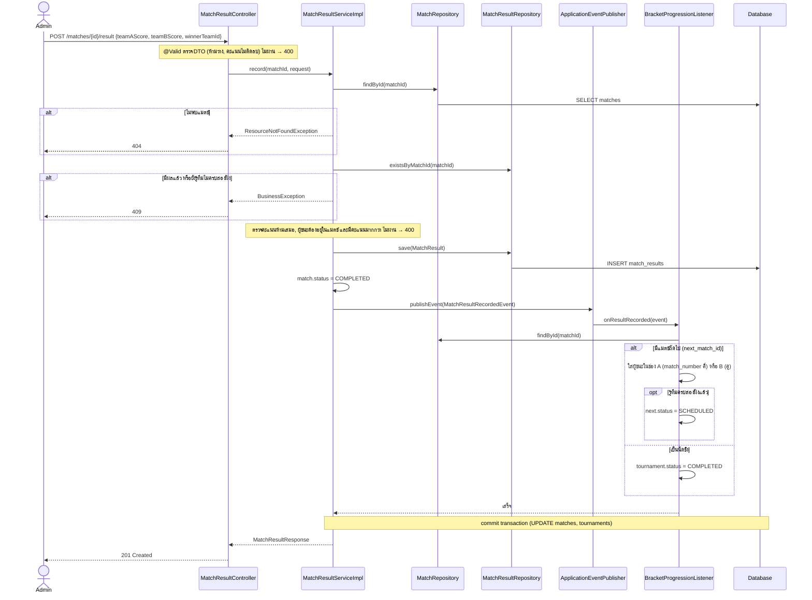
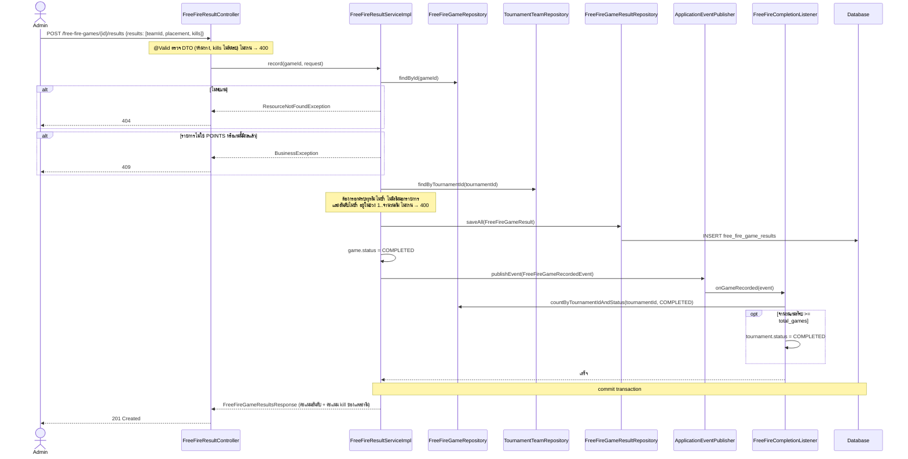

# Sequence Diagram: การบันทึกผลการแข่ง

ลำดับการทำงานของการบันทึกผลทั้งสองรูปแบบ ส่วนที่ทำต่อหลังบันทึกผล (ส่งผู้ชนะไปแมตช์ถัดไป หรือจบรายการ) ถูกแยกออกไปเป็น Listener ด้วย Observer Pattern ทุกขั้นทำงานใน transaction เดียวกัน ถ้า Listener ล้มเหลว ผลที่เพิ่งบันทึกจะถูก rollback ไปด้วย

## 1. แบบแพ้คัดออก: `POST /api/v1/matches/{matchId}/result`

## 2. แบบเก็บคะแนน (Free Fire): `POST /api/v1/free-fire-games/{gameId}/results`

คะแนนไม่ได้เก็บลงฐานข้อมูล แต่ `PointsCalculator` คำนวณจากผลดิบ (อันดับ, kills) ทุกครั้งที่เรียก `GET /tournaments/{id}/standings` และ `GET /free-fire-games/{id}/results`