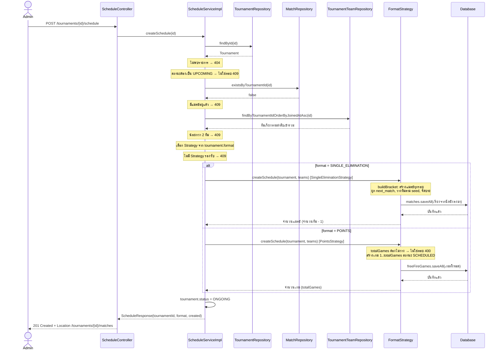

# Sequence Diagram: การสร้างตารางการแข่ง

ลำดับการทำงานของ `POST /api/v1/tournaments/{id}/schedule` ทั้งสองรูปแบบ (แพ้คัดออกและเก็บคะแนน) ส่วนที่ต่างกันคือขั้น "สร้างตาราง" ซึ่งถูกเลือกโดย Strategy Pattern

## จุดที่ควรชี้ตอนนำเสนอ

- **Strategy Pattern:** `ScheduleServiceImpl` เรียก `FormatStrategy.createSchedule` โดยไม่รู้ว่าเป็นรูปแบบไหน ตัวที่ถูกเลือกขึ้นกับ `tournament.format` ส่วน `alt` ในแผนภาพคือสองคลาสที่ implement interface เดียวกัน
- **ทุกขั้นตอนอยู่ใน Transaction เดียว** (`@Transactional` ที่ `ScheduleServiceImpl`) ถ้าขั้นใดโยน exception ข้อมูลที่บันทึกไปแล้วจะ rollback ทั้งหมด และสถานะรายการไม่เปลี่ยนเป็น `ONGOING`
- **Exception → HTTP status:** แต่ละกฎโยน `ResourceNotFoundException` (404), `BusinessException` (409) หรือ `ValidationException` (400) แล้ว `GlobalExceptionHandler` แปลงเป็น response ให้เอง Controller ไม่ต้องจับ exception
- **รายการที่เป็น `ONGOING` แล้ว** สร้างตารางซ้ำไม่ได้ (ตอบ 409) ซึ่งกันการสร้างสายซ้ำทั้งสองรูปแบบ

## ลำดับการ save แมตช์ (แพ้คัดออก)

`buildBracket` คืนรายการเรียงจากนัดชิงลงมา เพื่อให้ `saveAll` บันทึกแมตช์ปลายทางก่อน แมตช์รอบก่อนหน้าจึงอ้าง `next_match_id` ได้ ถ้าเรียงกลับด้านจะอ้างแมตช์ที่ยังไม่มี id
