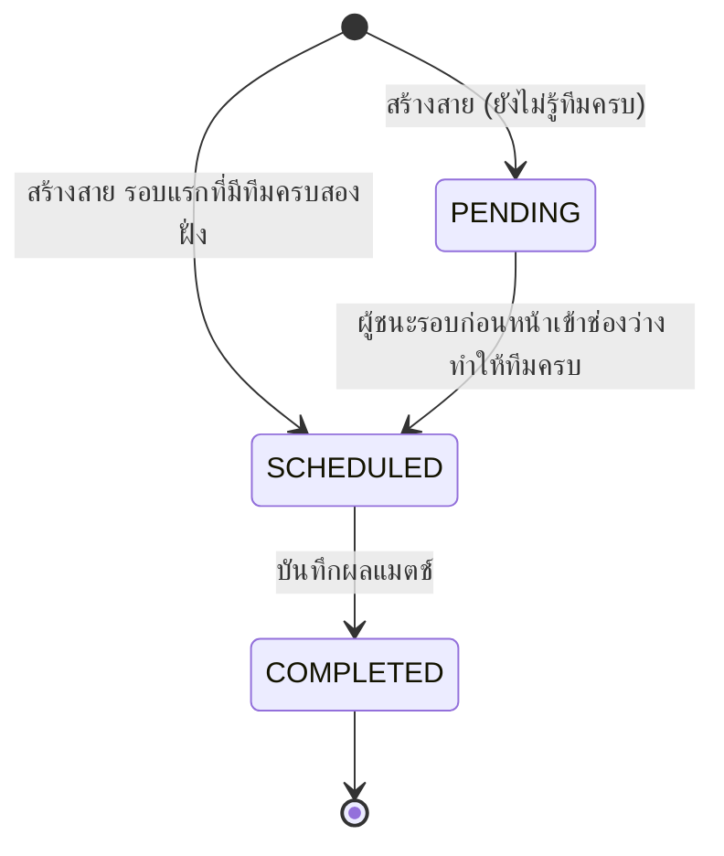
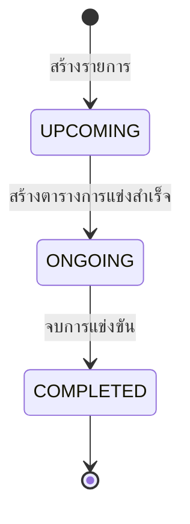

# State Diagram: Match และ Tournament

## Match (แพ้คัดออก)

สถานะเก็บในคอลัมน์ `matches.status` (`MatchStatus`)

| การเปลี่ยนสถานะ | ใครทำ | ที่ไหน |
| --- | --- | --- |
| `[*]` → `PENDING` / `SCHEDULED` | สร้างตารางการแข่ง | `SingleEliminationStrategy.buildBracket` |
| `PENDING` → `SCHEDULED` (จากบาย) | สร้างตารางการแข่ง | `SingleEliminationStrategy.placeInNextMatch` |
| `PENDING` → `SCHEDULED` (จากผลแมตช์) | Observer ของผลการแข่ง | `BracketProgressionListener` |
| `SCHEDULED` → `COMPLETED` | บันทึกผลแมตช์ | `MatchResultServiceImpl` |

แมตช์ที่ได้บาย **ไม่ถูกบันทึกลงฐานข้อมูล** ทีมที่ได้บายถูกส่งไปรอบถัดไปทันทีตอนสร้างสาย จึงไม่มีสถานะของแมตช์บาย

## Tournament

สถานะเก็บในคอลัมน์ `tournaments.status`

| การเปลี่ยนสถานะ | เงื่อนไข | ที่ไหน |
| --- | --- | --- |
| `UPCOMING` → `ONGOING` | สร้างตารางการแข่ง (`POST /tournaments/{id}/schedule`) | `ScheduleServiceImpl.createSchedule` |
| `ONGOING` → `COMPLETED` (แพ้คัดออก) | บันทึกผลนัดชิง (แมตช์ที่ไม่มี `next_match`) | `BracketProgressionListener` |
| `ONGOING` → `COMPLETED` (เก็บคะแนน) | กรอกผลครบทุกเกมตาม `totalGames` | `FreeFireCompletionListener` |

เมื่อรายการเป็น `ONGOING` แล้ว จะสร้างตารางซ้ำและเพิ่มทีมเข้ารายการไม่ได้อีก (ตอบ 409)
