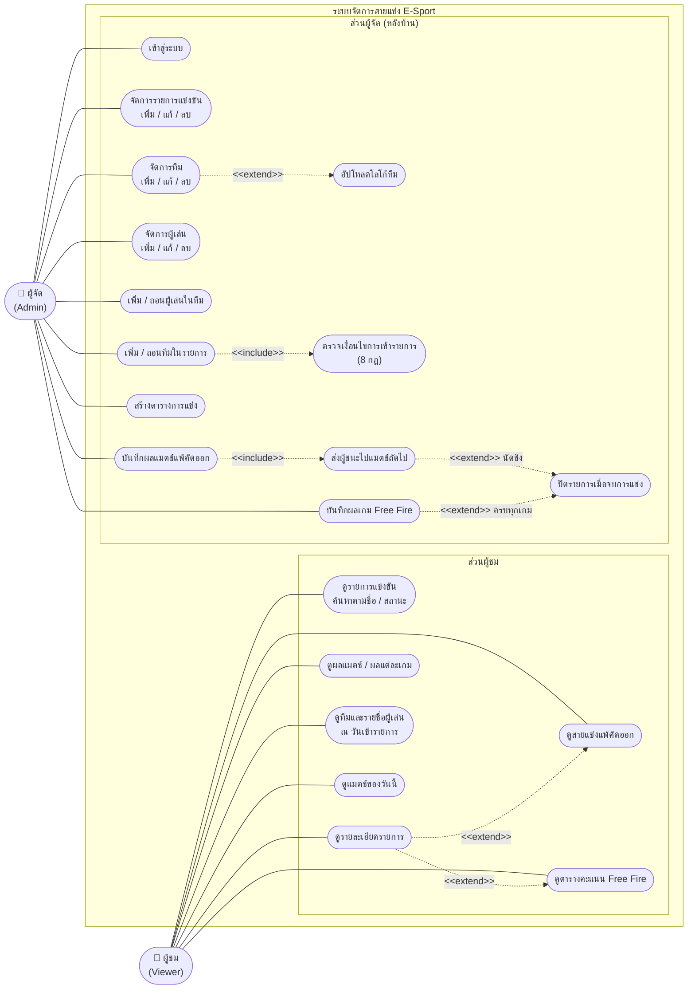

# Use Case Diagram: ระบบจัดการสายแข่ง E-Sport

ระบบมีผู้ใช้ 2 กลุ่ม **ผู้ชม (Viewer)** เข้าดูรายการ ตารางแข่ง และผลโดยไม่ต้องเข้าสู่ระบบ **ผู้จัด (Admin)** เป็นผู้กรอกและจัดการข้อมูลทั้งหมดในหลังบ้าน ระบบไม่เปิดให้ผู้เล่นหรือทีมสมัครเข้ารายการเอง

Mermaid ไม่มีแผนภาพ Use Case โดยตรง จึงใช้ `flowchart` แทน: วงรีคือ Use Case, เส้นทึบคือ Actor ใช้งาน, เส้นประคือ `<<include>>` / `<<extend>>`

## รายการ Use Case และ API ที่รองรับ

| รหัส | Use Case | Actor | API / ที่มา |
| --- | --- | --- | --- |
| UC1 | ดูรายการแข่งขัน ค้นหาตามชื่อ / สถานะ | ผู้ชม | `GET /api/v1/tournaments?name=&status=` |
| UC2 | ดูรายละเอียดรายการ | ผู้ชม | `GET /api/v1/tournaments/{id}` |
| UC3 | ดูสายแข่งแพ้คัดออก | ผู้ชม | `GET /api/v1/tournaments/{id}/matches` |
| UC4 | ดูตารางคะแนน Free Fire | ผู้ชม | `GET /api/v1/tournaments/{id}/standings`, `/free-fire-games`, `/placement-points` |
| UC5 | ดูผลแมตช์ / ผลแต่ละเกม | ผู้ชม | `GET /api/v1/matches/{id}/result`, `GET /api/v1/free-fire-games/{id}/results` |
| UC6 | ดูทีมและรายชื่อผู้เล่น ณ วันเข้ารายการ | ผู้ชม | `GET /api/v1/tournaments/{id}/teams`, `/teams/{teamId}/roster` |
| UC7 | ดูแมตช์ของวันนี้ | ผู้ชม | หน้าแรกเรียก `GET /api/v1/tournaments/{id}/matches` ของทุกรายการแพ้คัดออก แล้วกรองตามวันที่ |
| UC10 | เข้าสู่ระบบ | ผู้จัด | หน้า `/admin/login` (ยังเป็น mock ฝั่ง frontend) |
| UC11 | จัดการรายการแข่งขัน | ผู้จัด | `POST` / `PUT` / `DELETE /api/v1/tournaments` |
| UC12 | จัดการทีม | ผู้จัด | `POST` / `PUT` / `DELETE /api/v1/teams` |
| UC13 | อัปโหลดโลโก้ทีม | ผู้จัด | `PUT /api/v1/teams/{id}/logo` (PNG/JPEG ≤ 2 MB) |
| UC14 | จัดการผู้เล่น | ผู้จัด | `POST` / `PUT` / `DELETE /api/v1/players` |
| UC15 | เพิ่ม / ถอนผู้เล่นในทีม | ผู้จัด | `PUT` / `DELETE /api/v1/teams/{teamId}/players/{playerId}` |
| UC16 | เพิ่ม / ถอนทีมในรายการ | ผู้จัด | `TournamentTeamService.addTeam` / `removeTeam` |
| UC17 | ตรวจเงื่อนไขการเข้ารายการ | (ระบบ) | `TeamJoinRuleChain` (Chain of Responsibility) |
| UC18 | สร้างตารางการแข่ง | ผู้จัด | `POST /api/v1/tournaments/{id}/schedule` |
| UC19 | บันทึกผลแมตช์แพ้คัดออก | ผู้จัด | `POST /api/v1/matches/{id}/result` |
| UC20 | บันทึกผลเกม Free Fire | ผู้จัด | `POST /api/v1/free-fire-games/{id}/results` |
| UC21 | ส่งผู้ชนะไปแมตช์ถัดไป | (ระบบ) | `BracketProgressionListener` |
| UC22 | ปิดรายการเมื่อจบการแข่ง | (ระบบ) | `BracketProgressionListener`, `FreeFireCompletionListener` |

## สิ่งที่ยังไม่ครบตามแผนภาพ

- **UC10 เข้าสู่ระบบ:** backend ยังไม่มี Spring Security หน้าเข้าสู่ระบบตรวจรหัสจาก mock ใน `code/frontend/src/mock/auth.js` และ API ที่เขียนข้อมูลยังเรียกได้โดยไม่ต้องเข้าสู่ระบบ
- **UC16 เพิ่ม / ถอนทีมในรายการ:** มี `TournamentTeamServiceImpl` พร้อมเทสต์แล้ว แต่ยังไม่มี endpoint `POST` / `DELETE` ใน Controller
- หน้าหลังบ้านใน frontend ยังใช้ข้อมูลจาก `code/frontend/src/mock/` ส่วนหน้าผู้ชมเรียก API จริง
